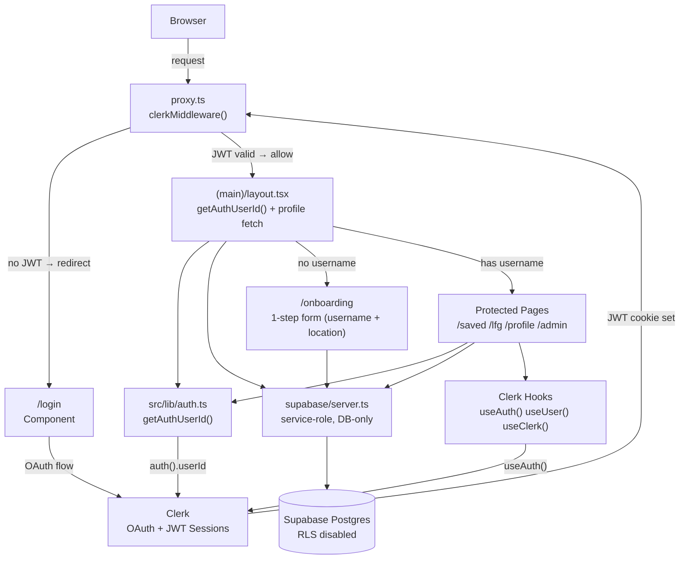
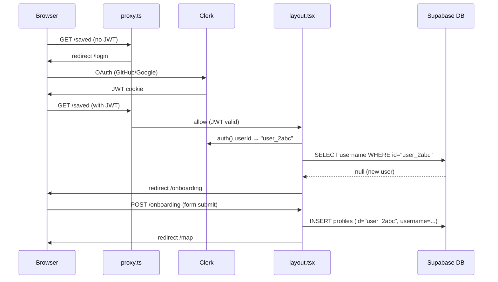

# Clerk Auth Migration - Architecture

## System Diagram (Mermaid)



## Auth Flow Sequence (New User)



## Auth Layer: Before vs After

```
BEFORE (Supabase Auth):

  Browser
    │
    ▼
  proxy.ts ──► updateSession() ──► Supabase Auth (cookie refresh)
    │                                      │
    ▼                                      │ supabase.auth.getUser()
  Next.js Pages                            │
    ├── Server Components ─────────────────┘
    │     └── supabase.auth.getUser()
    │
    └── Client Components
          └── supabase.auth.getUser()
                      │
                      ▼
              Supabase DB (RLS via auth.uid())


AFTER (Clerk):

  Browser
    │
    ▼
  proxy.ts ──► clerkMiddleware() ──► Clerk (JWT validation, local)
    │
    ▼
  Next.js Pages
    ├── Server Components ──► auth() ──► Clerk
    │     └── getAuthUserId()      returns userId (string | null)
    │
    └── Client Components
          └── useAuth() / useUser() / useClerk()
                      │
                      ▼
              Supabase DB (service-role, RLS disabled)
```

## Request Flow (Protected Route)

```
  User Browser
      │  GET /saved (unauthenticated)
      ▼
  proxy.ts (clerkMiddleware)
      │  No valid JWT → protect() → redirect to /login
      ▼
  /login page
      │  <SignIn> component (GitHub / Google)
      ▼
  Clerk OAuth flow (external)
      │  Callback to Clerk's internal URL
      ▼
  proxy.ts (clerkMiddleware)
      │  JWT valid → allow request
      ▼
  (main)/layout.tsx
      │  getAuthUserId() → "user_2abc..."
      │  DB: SELECT username FROM profiles WHERE id = "user_2abc..."
      │  No username? → redirect /onboarding
      │  Has username? → render page with profile
      ▼
  /saved page renders
```

## Component Architecture

```
┌─────────────────────────────────────────────────────────────┐
│                     Next.js 16 App                          │
│                                                             │
│  src/proxy.ts                                               │
│  ┌─────────────────────────────────────────────────────┐   │
│  │ clerkMiddleware                                      │   │
│  │  Public: /login, /map, /builders, /hackathons, /api │   │
│  │  Protected: /saved, /lfg, /profile, /admin          │   │
│  │  Root (/): redirect → /map                          │   │
│  └─────────────────────────────────────────────────────┘   │
│                                                             │
│  src/app/layout.tsx                                         │
│  ┌─────────────────┐                                        │
│  │  <ClerkProvider> │                                       │
│  │    <html>        │                                       │
│  │      <body>      │                                       │
│  │        {children}│                                       │
│  │      </body>     │                                       │
│  │    </html>       │                                       │
│  └─────────────────┘                                        │
│                                                             │
│  src/lib/auth.ts                                            │
│  ┌─────────────────────────────────────────┐               │
│  │ getAuthUserId() → auth().userId         │               │
│  │ Used by all 7 server components/routes  │               │
│  └─────────────────────────────────────────┘               │
│                                                             │
│  src/lib/supabase/server.ts  (DB-only, service-role)       │
│  src/lib/supabase/client.ts  (DB-only, anon key)           │
│  src/lib/supabase/service.ts (unchanged, admin/cron)       │
│                                                             │
└──────────────────────────────┬──────────────────────────────┘
                               │
                    ┌──────────┴──────────┐
                    │                     │
              ┌─────▼──────┐      _______________
              │   Clerk    │     /               \
              │  (OAuth +  │     │  Supabase DB  │
              │  Sessions) │     │  (Postgres)   │
              └────────────┘     │  RLS disabled │
                                 \_______________/
```

## Auth State by Component Type

| Component Type | Auth Source | Pattern |
|---------------|------------|---------|
| Server Component | `@clerk/nextjs/server` | `const userId = await getAuthUserId()` |
| Server API Route | `@clerk/nextjs/server` | `const { userId } = await auth()` |
| Client Component | `@clerk/nextjs` | `const { userId } = useAuth()` |
| Client (user data) | `@clerk/nextjs` | `const { user } = useUser()` |
| Client (sign out) | `@clerk/nextjs` | `const { signOut } = useClerk()` |
